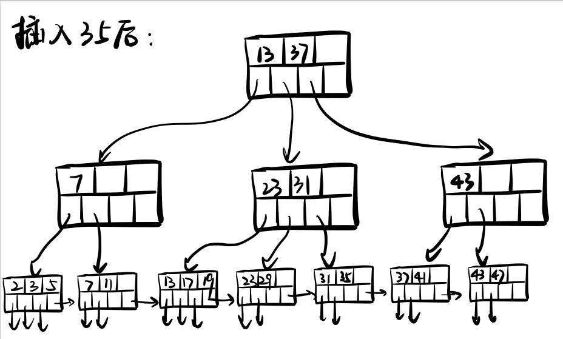
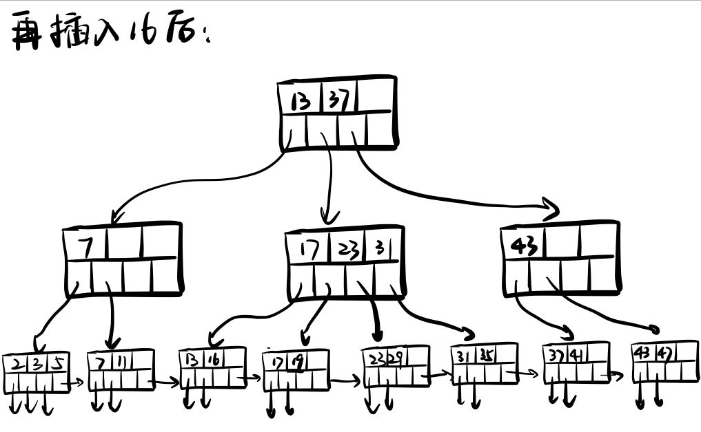
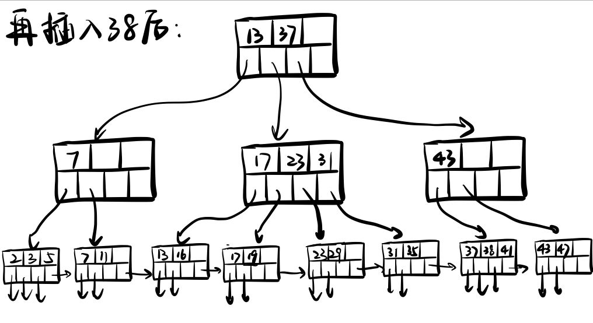
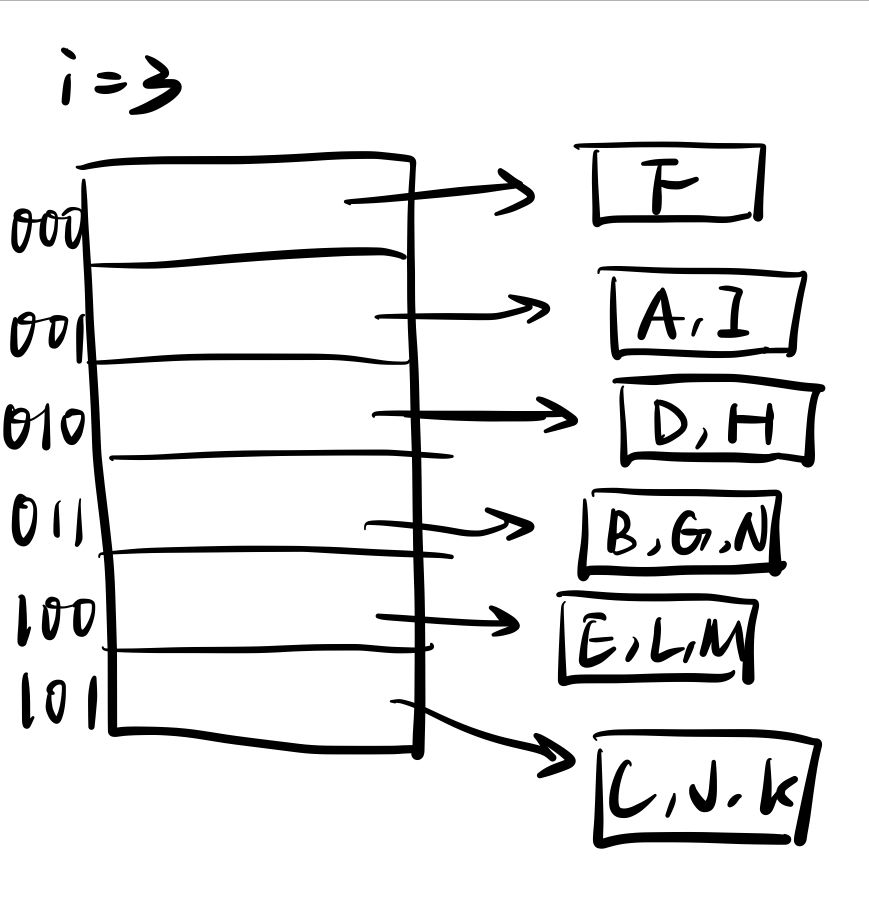

## 数据库 HW4

**PB20000215 丁程**

1、

2、
1）创建B+-tree索引并不能提高此查询的效率。因为B+-tree索引通常对完整的title进行索引，但查询要求的是title中包含给定关键词，而不是完整的title，查询的单词可能出现在title的任意位置。如果要查询的关键词位于title的中间或结尾，可能需要遍历索引中的大部分节点。

2）
使用倒排索引对其进行优化。

插入过程：
每当有新的文献被添加到数据库中时，首先将文献的title分割成单词，然后对于每个单词，如果它在倒排索引中不存在，则在倒排索引中添加一个新的条目，条目的键是该单词，值是一个列表，列表中的第一个元素是这篇文献的ID。如果该单词已经存在于倒排索引中，则只需将这篇文献的ID添加到对应的列表中即可。

查询过程：
当执行查询时，首先将查询的关键词分割成单词，然后在倒排索引中查找每个单词对应的文献ID列表。最后，返回所有这些列表的交集。

3、
1）
在按照A-N的顺序插入完后，可拓展散列索引中的数据如下：

其中共有6个桶，E所在的桶中全部键值为$ E,I,K$ 

2）
在插入完后，线性散列索引中的数据如下：

其中共有6个桶，B所在的桶中全部键值为$ B,G,N$ 
