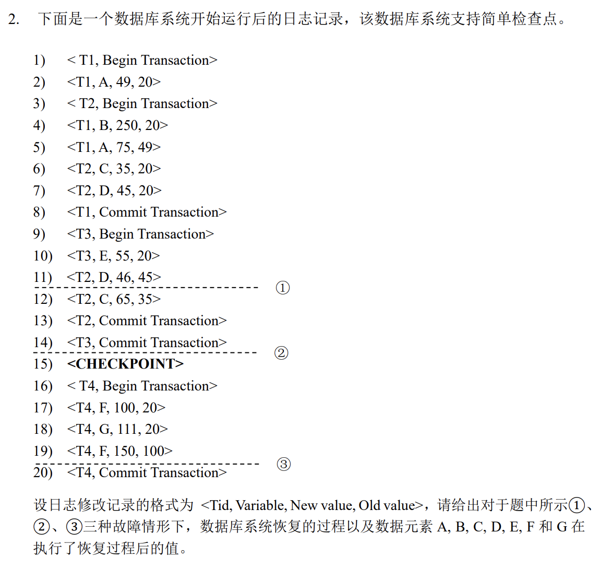
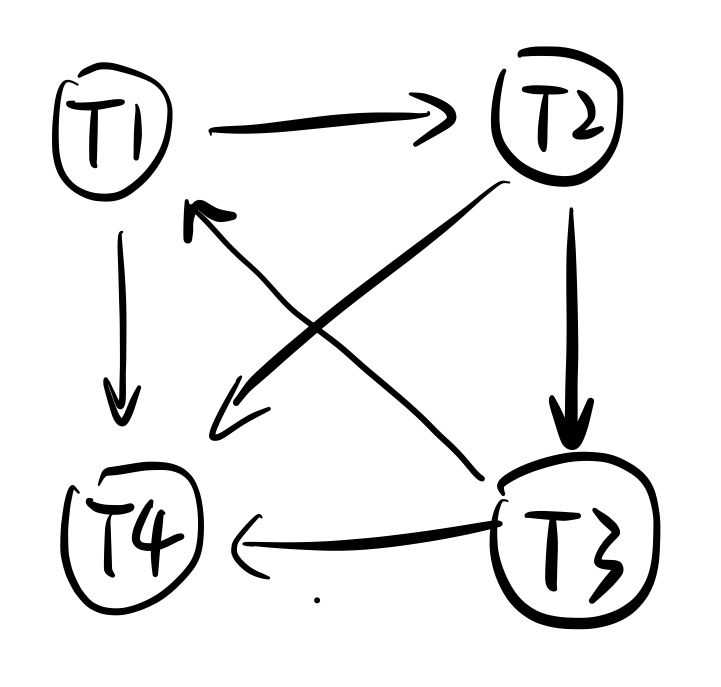
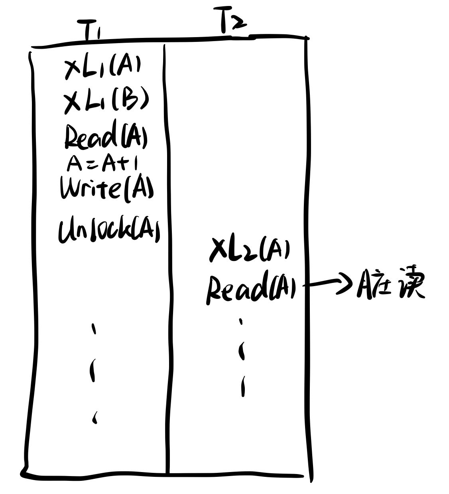

## 数据库 HW5

**PB20000215 丁程**

1、
如果支持嵌套事务，可能会有以下问题：
* 数据一致性：嵌套事务可能引起数据一致性的问题。内部事务的回滚可能会导致外部事务的数据状态与预期不符。处理这种情况需要实现复杂的数据一致性检查和恢复机制。
* 锁定和并发性问题：嵌套事务可能导致锁定和并发性问题。如果在外部事务中对某个数据对象进行了锁定，并且在内部事务中又对相同的对象进行了锁定，那么就可能发生死锁。处理这种情况需要引入更复杂的死锁检测和解决机制

2、

①：
T1:Redo
T2、T3:Undo
先Undo:D=45,E=20,D=20,C=20
再Redo:A=49,B=250,A=75
所以A=75,B=250,C=20,D=20,E=20,F=20,G=20

②：
T1、T2、T3:Redo
Redo:A=49,B=250,A=75,C=35,D=45,E=55,D=46,C=65
所以A=75,B=250,C=65,D=46,E=55,F=20,G=20

③：
检查点之前：
A=75,B=250,C=65,D=46,E=55,F=20,G=20
T4:Undo
Undo:F=100,G=20,F=20
所以A=75,B=250,C=65,D=46,E=55,F=20,G=20

3、
作出并发调度优先图如下：

其中存在环路 $T1 \rightarrow T2 \rightarrow T3 \rightarrow T1$
因此该并发调度不是冲突可串。

4、
假设存在一个并发调度S，其中所有事务都遵循2PL，但该调度不是可串调度。则其一定不是冲突可串调度，其优先图中存在环。

反证法：

(1)假设某个遵守2PL的调度不是可串行化调度；
(2)按Lock、UnLock操作中因锁不兼容而等待的关系构造调度的前趋图G；
(3)依据假设，若调度不是可串行化，则G中必存在环路，不妨设为：Ti1→Ti2→……→Tjp→Tin。
(4)其中某个冲突事务获得锁的前提是前面的冲突事务释放锁，则意味着Ti1解锁后Tjp才能获得锁，之后在环路中又出现Tin加锁；
(5) (4)中Ti违反了两阶段锁协议。

因此，根据反证法，如果一个并发调度S中的所有事务都遵循2PL，则该调度必定是可串调度。

5、
不是。仍然可能出现脏读问题。要解决脏读需要用S2PL。举例：
